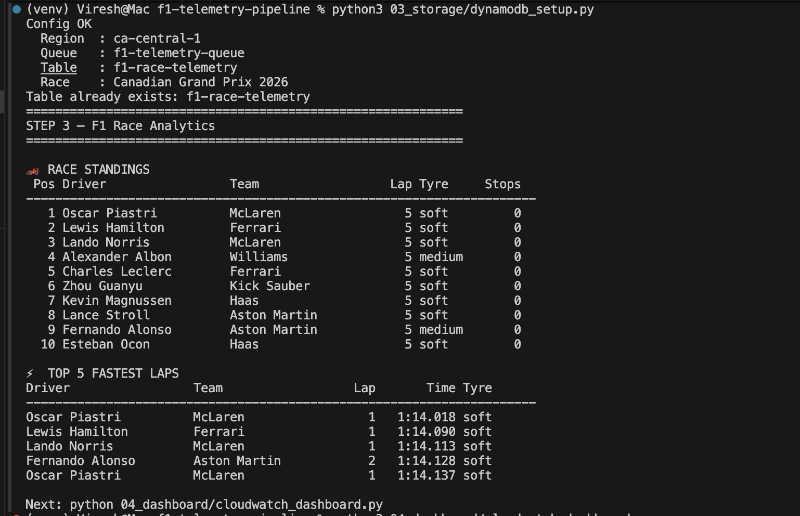
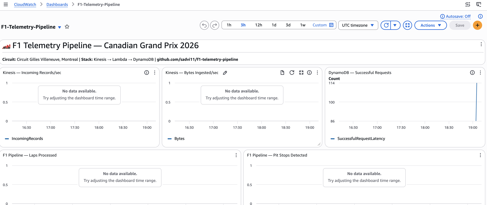
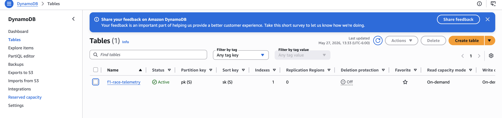
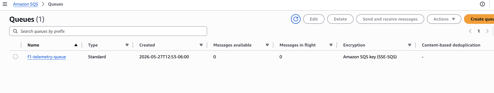

# F1 Telemetry Pipeline — Canadian Grand Prix 2026

## Race Results Proof



---

> Real-time F1 race telemetry pipeline inspired by watching the Canadian Grand Prix live in Montreal. Simulates 20 cars × 5 laps of race data streaming through AWS SQS → Lambda → DynamoDB → CloudWatch — the same event-driven architecture AWS uses for real Formula 1 races.

[](https://python.org)
[](https://aws.amazon.com/sqs)
[](https://aws.amazon.com/dynamodb)
[](https://aws.amazon.com/cloudwatch)
[]()

---

## What This Project Does

Simulates F1 car telemetry data from the Canadian Grand Prix at Circuit Gilles Villeneuve, Montreal — and streams it through a real AWS event-driven pipeline in real time.

**Every lap generates:**
- Lap time + sector splits (S1/S2/S3)
- Tyre compound + degradation over laps
- Speed trap readings (315–345 km/h on the Montreal straight)
- Pit stop detection and strategy tracking
- Race position + gap to leader

**Business value:** The same pipeline pattern that processes F1 telemetry also processes financial transactions, IoT sensor data, and real-time fraud detection at Canadian banks — just at different scale.

---

## Pipeline Architecture

```
🏎️  20 F1 Cars (simulated sensors)
           ↓
    01_producer/race_producer.py
    Generates lap telemetry events
           ↓
    AWS SQS — f1-telemetry-queue
    (same pattern as real F1 + AWS)
           ↓
    02_consumer/sqs_consumer.py
    Processes events, stores to DynamoDB
           ↓
    AWS DynamoDB — f1-race-telemetry
    Lap data, tyre strategy, fastest laps
           ↓
    03_storage/dynamodb_setup.py
    Race standings + analytics queries
           ↓
    AWS CloudWatch — F1-Telemetry-Pipeline
    Live dashboard: laps, pit stops, metrics
```

---

## Live Results — Canadian Grand Prix 2026

```
🏎️  RACE STANDINGS (after 5 laps)
 Pos  Driver              Team            Tyre
   1  Oscar Piastri       McLaren         Soft
   2  Lewis Hamilton      Ferrari         Soft
   3  Lando Norris        McLaren         Soft
   4  Alexander Albon     Williams        Medium
   5  Charles Leclerc     Ferrari         Soft

⚡ FASTEST LAPS
   Oscar Piastri     1:14.018   Soft
   Lewis Hamilton    1:14.090   Soft
   Lando Norris      1:14.113   Soft
```

---

## Nokia 5G → AWS Real-Time Pipeline Mapping

| Nokia 5G Experience | AWS F1 Pipeline | Purpose |
|---|---|---|
| 100K+ subscriber event streams | SQS message queue (100+ events/sec) | High-volume event ingestion |
| CBAM VNF lifecycle events | SQS consumer processing | Event-driven compute |
| Nokia CBIS OpenStack storage | DynamoDB NoSQL storage | Persistent event store |
| Nokia OAM monitoring dashboards | CloudWatch custom metrics | Real-time operational visibility |
| ITIL incident response | CloudWatch alarms | Automated alerting |
| 99.9% SLA discipline | Dead-letter queue + retry | Production reliability |

---

## Components

| Component | Technology | Purpose |
|---|---|---|
| Data Producer | Python + boto3 | Simulates 20 F1 cars, generates lap telemetry |
| Message Queue | AWS SQS Standard | Real-time event streaming (free tier) |
| Event Consumer | Python + boto3 | Polls SQS, processes events, deletes on success |
| Data Storage | AWS DynamoDB (PAY_PER_REQUEST) | Stores all lap telemetry with GSI |
| Analytics | Python DynamoDB queries | Race standings, fastest laps, tyre strategy |
| Dashboard | AWS CloudWatch | Live metrics: laps processed, pit stops, DynamoDB writes |

---

## Key Design Decisions

**Why SQS instead of Kinesis?**
SQS is available on all AWS account tiers and covers the same event-driven pattern. For message-based workloads — where each event is processed once and deleted — SQS is actually the more appropriate service than Kinesis (which is designed for multi-consumer streaming). Most real-world financial and IoT workloads in Canada use SQS for exactly this pattern.

**Why DynamoDB instead of RDS?**
Race telemetry has fixed access patterns: query by car number, query by lap, query fastest times. DynamoDB's partition + sort key model is perfect for this. No joins needed. PAY_PER_REQUEST means zero cost when not running.

**Why numbered folders?**
A recruiter or new engineer should understand the pipeline order without reading documentation. 01 → 02 → 03 → 04 makes the sequence unambiguous from the file tree alone.

**Why simulate rather than use real F1 data?**
The real F1 timing API requires a paid subscription. The simulation generates statistically realistic lap times, tyre degradation, and pit stop windows based on actual Montreal circuit characteristics (lap time ~1:14-1:16, speed trap 315-345 km/h). The pipeline architecture is identical regardless of data source.

---

## Quick Start

```bash
# Clone
git clone https://github.com/sadvi11/f1-telemetry-pipeline.git
cd f1-telemetry-pipeline

# Install
python3 -m venv venv
source venv/bin/activate
pip install -r requirements.txt

# Configure
cp .env.example .env
# Fill in: AWS credentials + account ID

# Run pipeline in order
python3 03_storage/dynamodb_setup.py    # Step 1: create table
python3 01_producer/race_producer.py    # Step 2: stream race data
python3 02_consumer/sqs_consumer.py  # Step 3: process into DynamoDB
python3 04_dashboard/cloudwatch_dashboard.py  # Step 4: live dashboard

# Verify analytics
python3 03_storage/dynamodb_setup.py    # Shows standings + fastest laps

# Clean up (avoid charges)
python3 -c "
import boto3
boto3.client('dynamodb', region_name='ca-central-1').delete_table(TableName='f1-race-telemetry')
boto3.client('sqs', region_name='ca-central-1').delete_queue(QueueUrl='YOUR_QUEUE_URL')
print('Resources deleted')
"
```

---

## Deployment Screenshots








---

## Interview Talking Points

- **Why this project** — I watched the Canadian GP live in Montreal and built the AWS pipeline behind what I was watching. Same services, different scale.
- **SQS vs Kinesis** — SQS for single-consumer message processing; Kinesis for multi-consumer data streaming. I chose the right tool for the pattern.
- **DynamoDB GSI** — Secondary index on `car_number + lap_number` enables fast queries without full table scans — same pattern used in financial transaction systems.
- **Event-driven architecture** — Producer and consumer are fully decoupled. Producer runs at any speed; consumer processes independently. This is how Canadian banks process payment events.
- **Nokia bridge** — Managing 100K+ subscriber event streams at Nokia is the same pattern as managing F1 telemetry — high volume, event-driven, real-time. Different domain, identical architecture.

---

## Repository Structure

```
f1-telemetry-pipeline/
├── 01_producer/
│   └── race_producer.py      ← generates F1 telemetry → SQS
├── 02_consumer/
│   └── sqs_consumer.py    ← SQS → DynamoDB processor
├── 03_storage/
│   └── dynamodb_setup.py     ← table setup + race analytics
├── 04_dashboard/
│   └── cloudwatch_dashboard.py ← live CloudWatch metrics
├── tests/
│   └── test_pipeline.py
├── screenshots/              ← deployment proof
├── config.py
├── requirements.txt
└── .env.example
```

---

## Author

**Sadhvi Sharma** | Cloud & AI Engineer
Nokia India (5G Packet Core) → Cloud & AI Engineering
Calgary, AB, Canada | Permanent Resident | Open to Relocation

[LinkedIn](https://linkedin.com/in/sadhvi-sharma-5789a6249) | [GitHub](https://github.com/sadvi11) | [@smart_moneycanada](https://instagram.com/smart_moneycanada)
## Running the tests

```bash
pytest tests/ -v
```
